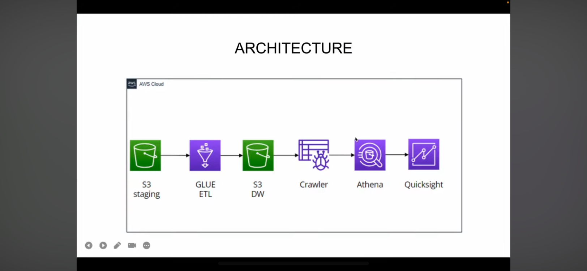
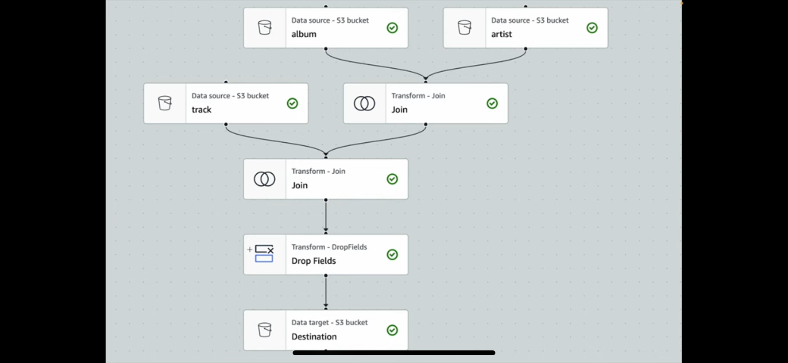

# AWS Spotify Data Pipeline

## Overview
This project implements an automated data pipeline for processing Spotify music data using AWS cloud services. The pipeline ingests, transforms, and analyzes Spotify artist and track data, demonstrating a scalable ETL (Extract, Transform, Load) architecture.

## Architecture


The project follows a modern data engineering architecture leveraging multiple AWS services for efficient data processing and analytics.

## Pipeline Flow


## Project Structure
```
AWS-spotify-main/
├── Architecture.PNG      # System architecture diagram
├── PipelineFlow.PNG     # Data pipeline flow diagram
├── artists.csv          # Spotify artist data (~1.7 MB)
└── track.csv            # Spotify track data (~11 MB)
```

## Data Sources

### Artists Dataset
- **File**: `artists.csv`
- **Size**: ~1.7 MB
- **Description**: Contains information about Spotify artists including metadata, popularity metrics, and genre information

### Tracks Dataset
- **File**: `track.csv`
- **Size**: ~11 MB
- **Description**: Contains detailed information about Spotify tracks including audio features, popularity, and metadata

## Features

- **Automated Data Ingestion**: Extract Spotify data from CSV sources
- **Data Transformation**: Clean, normalize, and enrich music data
- **Scalable Processing**: Built on AWS cloud infrastructure for handling large datasets
- **Analytics Ready**: Processed data optimized for analytics and visualization

## AWS Services Used

This project leverages various AWS services for building a robust data pipeline:

- **AWS S3**: Data storage and data lake
- **AWS Lambda**: Serverless data processing functions
- **AWS Glue**: ETL jobs and data catalog
- **Amazon Athena**: SQL queries on processed data
- **AWS CloudWatch**: Monitoring and logging
- **AWS IAM**: Security and access management

## Getting Started

### Prerequisites
- AWS Account with appropriate permissions
- AWS CLI configured
- Python 3.x installed
- Basic knowledge of AWS services

### Deployment
1. Clone the repository
2. Configure AWS credentials
3. Upload data files to S3
4. Deploy Lambda functions and Glue jobs
5. Configure triggers and scheduling

## Data Processing Pipeline

1. **Ingestion**: Raw CSV files are uploaded to S3 landing zone
2. **Transformation**: AWS Glue or Lambda processes and cleans the data
3. **Storage**: Transformed data stored in S3 processed zone
4. **Cataloging**: AWS Glue Crawler catalogs the data
5. **Analytics**: Query data using Amazon Athena

## Use Cases

- Music recommendation systems
- Artist popularity analysis
- Track feature analysis
- Trend identification
- Genre classification
- Music data warehouse

## Future Enhancements

- [ ] Real-time data ingestion using Spotify API
- [ ] Machine learning models for recommendations
- [ ] Interactive dashboards using QuickSight
- [ ] Data quality checks and validation
- [ ] Incremental data loading
- [ ] Cost optimization strategies

## Contributing

Contributions are welcome! Please feel free to submit a Pull Request.

## License

This project is open source and available for educational purposes.

## Contact

For questions or feedback, please open an issue in the repository.

---

**Note**: This project is designed for educational and demonstration purposes to showcase AWS data engineering capabilities with Spotify music data.